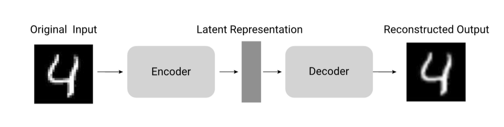

# 🧠 **Autoencoder: Architettura, Funzionamento e Applicazioni**

## 1️⃣ **Cos’è un Autoencoder?**

Un **autoencoder** è una **rete neurale artificiale** utilizzata principalmente per:

* 🔎 **Task non supervisionati**
* 📉 **Riduzione della dimensionalità** (Dimensionality Reduction)
* 🔄 **Ricostruzione dei dati di input**

**Caratteristica principale:**
Impara a **comprimere** i dati in una rappresentazione latente più compatta (encoding) e poi a **ricostruire** i dati originali (decoding), tutto **senza bisogno di etichette** (apprendimento non supervisionato).

---

## 2️⃣ **Architettura di un Autoencoder**

### **Componenti principali**

* **Encoder** 🧬

  * Riceve i dati di input
  * Li trasforma in una rappresentazione a **dimensione ridotta** (**spazio latente**)
  * Composto da uno o più layer che riducono progressivamente la dimensionalità

* **Spazio Latente** 💠

  * Rappresentazione **compressa** dei dati
  * Contiene solo le feature **più rilevanti** ed essenziali

* **Decoder** 🔁

  * Prende la rappresentazione dallo spazio latente
  * Prova a **ricostruire** il dato nello spazio originale
  * Anche qui, uno o più layer **espandono** progressivamente la dimensionalità

---

## 3️⃣ **Funzionamento: Come “Impara” un Autoencoder?**

* **Obiettivo del training** 🎯:
  Minimizzare l’**errore di ricostruzione** tra input originale e output ricostruito (solitamente tramite funzione di costo come **MSE – Mean Squared Error**).

* **Step fondamentali**

  1. **Feature Extraction** 🧲
     L’encoder estrae e trattiene le informazioni più importanti dei dati.
  2. **Compressione nello spazio latente** 💾
     I dati vengono compressi, mantenendo solo ciò che è rilevante.
  3. **Ricostruzione** 🛠️
     Il decoder prova a ricostruire i dati originali partendo dalla rappresentazione compressa. I dati ricostruiti non sono identici ma molto simili agli originali.



* **Addestramento** 🔄

  * Si passa l’input nell’encoder → compressione → spazio latente
  * Lo spazio latente passa nel decoder → ricostruzione output
  * Calcolo errore → **Backpropagation** aggiorna i pesi (sia dell'encoder che del decoder) per minimizzare la differenza tra input e output, ovvero minimizzare la funzione di costo
  * Questo ciclo viene ripetuto per molte epoche, fino ad ottenere ricostruzioni soddisfacenti, cioè quando il valore della funzione di costo è per noi accettabile

---

## 4️⃣ **Perché funziona? L’Intuizione del “Collo di Bottiglia”** 🍼

* L’autoencoder crea un **bottleneck** (collo di bottiglia), costringendo la rete a passare solo le **informazioni più rilevanti** nello spazio latente
* In questo modo, il modello:

  * Impara a **scartare il rumore**
  * Trattiene solo le **feature fondamentali**
* L’architettura favorisce quindi una **compressione efficiente** e una rappresentazione dei dati più robusta

---

## 5️⃣ **Applicazioni Principali degli Autoencoder** 🚀

1. **Dimensionality Reduction** 📉

   * Riducono la dimensionalità dei dati senza supervisione
   * Utile per **visualizzazione**, **compressione dati** e **pre-processing** di modelli successivi

2. **Anomaly Detection** ⚠️

   * Allenando un autoencoder solo su dati “normali” (senza anomalie), un errore di ricostruzione elevato indica probabili anomalie nei dati in input

3. **Denoising** 🔊➡️🤫

   * Rimozione del rumore dai dati (es. immagini “sporche” → immagini pulite)
   * Addestrato a ricostruire dati puliti da input rumorosi

4. **Compressione e Generazione di Immagini** 🗜️🖼️

   * Compressione efficiente di immagini
   * Varianti (es. Variational Autoencoder) sono capaci di **generare nuovi dati** simili a quelli visti in training

---

## 6️⃣ **Composizione dell'Autoencoder

* Un Autoencoder è formato da due reti distinte
  - Una per l'encoding: prende in input il dato e lo trasporta nello sapzio latente
  - Una per il decoding: parte dallo spazio latente e ricostruisce il dato nello spazio di input
* Queste due reti distinte non devono necessariamente lavorare insieme, l'importante è che entrambe le reti siano addestrate sugli stessi dati.
  - Ad es. Su una macchina abbiamo l'ecoder, su un'altra il decoder

---

## 7️⃣ **Varianti degli Autoencoder** 🧬

* **Sparse Autoencoder**
  Introducono un vincolo di **sparsità** nella loss function → la rappresentazione latente contiene molti zeri, rendendola più compatta

* **Denoising Autoencoder**
  Specializzati nel rimuovere il rumore dai dati di input

* **Variational Autoencoder (VAE)**
  Introducono una modellazione **probabilistica** nello spazio latente → usati per **generazione di nuovi dati** e **data augmentation**

* **Contractive Autoencoder**
  Aggiungono regolarizzazione per rendere lo spazio latente **robusto a piccole variazioni** nell’input

---

## 8️⃣ **Caratteristiche Chiave dello Spazio Latente** 💠

* **Dimensione Ridotta** 📏
  Molto più piccola rispetto ai dati originali grazie ai vari passaggi di encoding e pooling

* **Feature Importanti** 🌟
  Si conservano solo le informazioni essenziali e i pattern principali

* **Compressione “Lossy”** ⚠️
  Alcune informazioni vengono perse (non tutta la ricostruzione è perfetta), ma si mantengono le caratteristiche principali

* **Data Specific** 🧬
  Gli autoencoder funzionano meglio su dati **simili** a quelli usati per l’addestramento

---

## 9️⃣ **Processo di Addestramento** 🔁

1. Passaggio dell’input nell’encoder
2. Compressione nello spazio latente (bottleneck)
3. Decodifica per ricostruire l’input
4. Calcolo dell’errore di ricostruzione (**es. MSE**)
5. Backpropagation per aggiornare i pesi
6. Ripetizione del ciclo per molte epoche

---

## 🔟 **Limiti e Considerazioni** 🛑

* La **ricostruzione non sarà mai perfetta**: la compressione comporta perdita di informazioni (lossy). L'output sarà sicuramente diversa dall'input (anche solo per un bit)
* **Funzionano meglio** se dati di test sono simili ai dati di training (data-specific)
* Sono **non supervisionati**: non necessitano di etichette (labels) per l’addestramento

---

## 11 **Riepilogo Visuale** 📝

```
Input Data → [Encoder] → [Spazio Latente] → [Decoder] → Output Ricostruito
        |----------- Minimizzare l’errore di ricostruzione -----------|
```

---

## 🔍 **Riassunto finale**

Gli **autoencoder** sono **architetture fondamentali** nel machine learning e nel deep learning, soprattutto per **estrarre** le informazioni più importanti da grandi quantità di dati, **ricostruire** input, **scovare anomalie**, **ripulire dati rumorosi** e **generare** nuovi dati.
Grazie al **collo di bottiglia**, imparano rappresentazioni **efficienti**, seppur “lossy”, dei dati originali, risultando strumenti estremamente **versatili** per moltissimi task nel mondo dell’AI. 🚀

---
