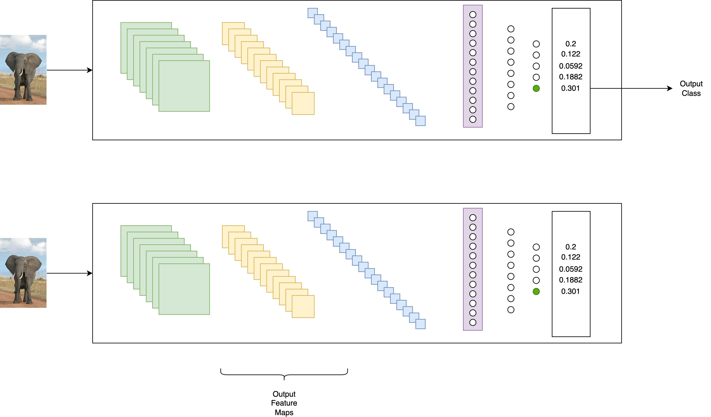

## 🧠 **Cos’è un Feature Extractor**


* **Feature Extractor** = Estrattore di caratteristiche.
* Consente di **recuperare le Feature Maps** intermedie di una CNN senza arrivare alla classificazione finale.
* Le **Feature Maps** sono i risultati dei processi intermedi, dei passaggi intermedi che si trovano all'interno di una CNN.
* Utile per:

  * *Debugging*
  * *Comprensione visiva* di ciò che la rete convoluzionale apprende a diversi livelli
  * *Explainability* del modello

---

## 🧩 **Flusso standard vs Feature Extractor**

### Flusso standard di una Rete Convolutiva Pre-addestrata

* Immagine → Layers convoluzionali → Flatten → Dense → Classificazione finale (es. ImageNet 1000 classi)

### Feature Extractor

* Immagine → Layers convoluzionali → ❌ Nessuna Flatten/Dense → ❌ Classificazione finale 

✅ Ci interessano gli Output da uno o più layer intermedi (Feature Maps)

* Possibilità di:

  * Prelevare output da uno o più layer specifici
  * Analizzare visivamente ogni Feature Map come una "immagine" (matrice)




---

## ⚙️ **Setup con ResNet50v2 (preaddestrata su ImageNet, vedi il notebook corrispondente)**

* Architettura complessa, con molti blocchi convoluzionali e connessioni shortcut (ResNet)
* Caricamento:

  ```python
  model = ResNet50V2(weights="imagenet", include_top=False)
  ```

  * `include_top=False`: esclude Flatten e Dense finali → adatta per estrazione feature

---

## 🔍 **Selezione Layer da cui estrarre Feature Maps**

* Due layer scelti:

  * `conv2_block1_1_conv` → Layer superficiale
  * `conv5_block3_3_conv` → Layer profondo

* Codice:

  ```python
  layer_names = ['conv2_block1_1_conv', 'conv5_block3_3_conv']
  layers = [resnet_model.get_layer(name=layer_name) for layer_name inlayer_names]

  feature_extractor = keras.Model(inputs=model.inputs, outputs=[layer.output for layer in layers])
  ```

---

## 🖼️ **Preprocessing immagine d'ingresso**

1. Caricamento immagine (`elephant.jpg`)
2. Resize a 224x224 (formato ResNet)
3. Conversione in tensore (NumPy + `expand_dims`)
4. Preprocessing specifico ResNet:

   ```python
   img = preprocess_input(img)
   ```

---

## 🧪 **Estrazione e analisi delle Feature Maps**

### Output del Feature Extractor

* Output shape layer superficiale:

  ```
  (1, 56, 56, 64) → 64 feature map 56x56
  ```
* Output shape layer profondo:

  ```
  (1, 7, 7, 2048) → 2048 feature map 7x7
  ```

### Accesso alle Feature Maps

* Possibilità di accedere:

  * A tutte le feature map
  * Alla singola immagine all’interno del batch
  * A singola feature map 2D
  * A singolo valore (pixel) nella feature map

---

## 🖼️ **Visualizzazione con `matplotlib`**

* Si può usare:

  ```python
  plt.imshow(feature_map, cmap="viridis")
  ```
* Feature Map superficiale:

  * Evidenzia ancora l’oggetto (elefante) e i suoi bordi
* Feature Map profonda:

  * La forma dell’oggetto è persa
  * Le attivazioni forti indicano che è stata rilevata una “presenza”, ma non interpretabile umanamente

---

## 🎯 **Differenza con classificazione completa**

* Usando `include_top=True`:

  * Output shape: `(1, 1000)` → 1000 classi
  * Le prime 3 predizioni (decodificate): *African elephant*, *Tusker*, *Indian elephant*
* Dimostra che il modello ResNet50v2 è efficace sulla classificazione se usato completamente

---

## ✅ **Conclusioni e utilità**

* Il Feature Extractor consente di "vedere il mondo con gli occhi della CNN"
* Favorisce la **spiegabilità (explainability)** delle reti deep learning
* Permette:

  * Debug visivo
  * Interpretazione qualitativa delle attivazioni
  * Studio della rappresentazione progressiva delle informazioni

